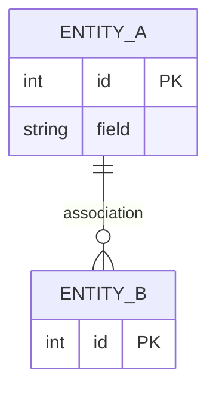

# Modélisation des données

## MCD (Modèle Conceptuel)

> À compléter en Mermaid. Au moins 3 entités, avec cardinalités.



## MLD (Modèle Logique)

> Liste les tables avec colonnes et clés étrangères en pseudo-SQL.

```
livre(id PK, titre, auteur_id FK, ...)
auteur(id PK, nom, ...)
...
```

## MPD (Modèle Physique — SQL PostgreSQL)

```sql
-- À compléter avec les CREATE TABLE complets, types, contraintes
CREATE TABLE auteur (
  id SERIAL PRIMARY KEY,
  -- ...
);

-- ...
```

## Notes de modélisation

> Justifie tes choix : pourquoi cette table de jointure ? pourquoi tel type ?
> ...
