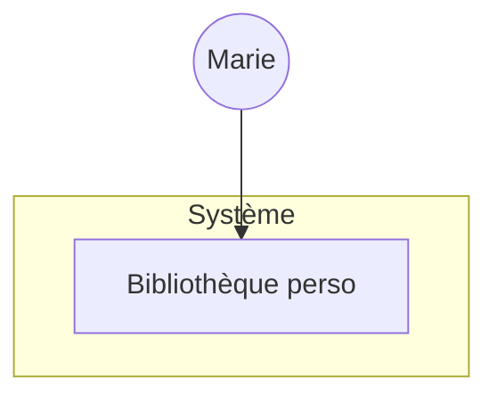
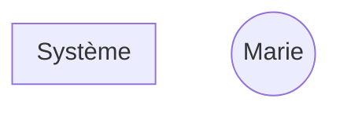

# Architecture C4

## Niveau 1 — Context

> Le système entouré de ses utilisateurs et systèmes externes.

## Niveau 2 — Container

> Le système éclaté en blocs déployables (front, back, base, etc.).

## Stack technique proposée

| Couche | Technologie | Pourquoi |
|--------|-------------|----------|
| Frontend | | |
| Backend / API | | |
| Base de données | | |
| Auth | | |
| Hébergement | | |

## Estimation

- **Volume V1** : ~ X user stories, Y jours-homme
- **Coût mensuel d'infra** : ~ Z € (justifier)
