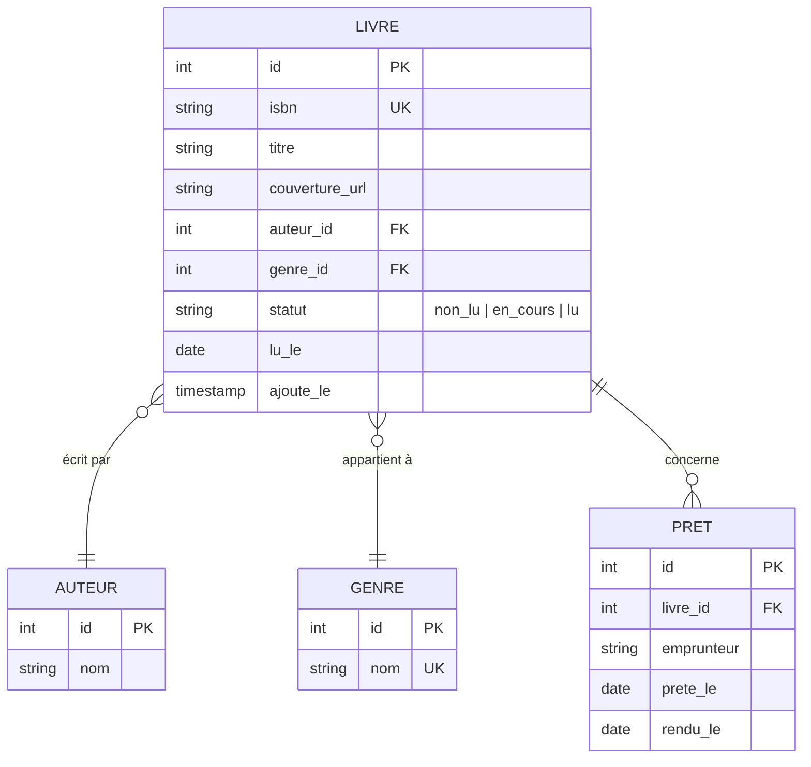

# Modélisation des données

## MCD (Modèle Conceptuel)



### Notes de modélisation

- Une **table `pret`** plutôt qu'une colonne sur `livre` : permet l'historique des prêts (un livre peut être prêté plusieurs fois à différents amis).
- L'**emprunteur est en texte libre** (pas une entité) car le brief n'évoque pas de comptes pour les amis. Si V2 ajoute des comptes, on créera une entité `personne` et une FK.
- **Statut** en enum sur le livre, pas table séparée : trois valeurs fixes, pas besoin de surdimensionner.
- Pas de relation N-N livre/auteur en V1 (un livre = un auteur). À évaluer si Marie commence à avoir des co-écrits.

## MLD

```
auteur(id PK, nom)
genre(id PK, nom UK)
livre(id PK, isbn UK NULL, titre, couverture_url NULL,
      auteur_id FK auteur, genre_id FK genre,
      statut, lu_le NULL, ajoute_le)
pret(id PK, livre_id FK livre, emprunteur, prete_le, rendu_le NULL)
```

## MPD (PostgreSQL)

```sql
CREATE TABLE auteur (
  id SERIAL PRIMARY KEY,
  nom TEXT NOT NULL
);

CREATE TABLE genre (
  id SERIAL PRIMARY KEY,
  nom TEXT UNIQUE NOT NULL
);

CREATE TYPE statut_lecture AS ENUM ('non_lu', 'en_cours', 'lu');

CREATE TABLE livre (
  id SERIAL PRIMARY KEY,
  isbn VARCHAR(17) UNIQUE,
  titre TEXT NOT NULL,
  couverture_url TEXT,
  auteur_id INT NOT NULL REFERENCES auteur(id) ON DELETE RESTRICT,
  genre_id INT REFERENCES genre(id) ON DELETE SET NULL,
  statut statut_lecture NOT NULL DEFAULT 'non_lu',
  lu_le DATE,
  ajoute_le TIMESTAMPTZ NOT NULL DEFAULT now()
);

-- Index pour la recherche full-text US-05
CREATE INDEX livre_recherche_idx ON livre
  USING gin(to_tsvector('french', titre || ' ' || coalesce(isbn, '')));

CREATE INDEX livre_auteur_idx ON livre(auteur_id);

CREATE TABLE pret (
  id SERIAL PRIMARY KEY,
  livre_id INT NOT NULL REFERENCES livre(id) ON DELETE CASCADE,
  emprunteur TEXT NOT NULL,
  prete_le DATE NOT NULL DEFAULT CURRENT_DATE,
  rendu_le DATE
);

CREATE INDEX pret_livre_idx ON pret(livre_id);
CREATE INDEX pret_en_cours_idx ON pret(livre_id) WHERE rendu_le IS NULL;
```

### Décisions justifiées

- **`ON DELETE RESTRICT` sur auteur** : on ne supprime pas un auteur qui a des livres ; on les réassigne d'abord.
- **`ON DELETE SET NULL` sur genre** : si on supprime un genre, les livres restent mais perdent leur classification.
- **`ON DELETE CASCADE` sur pret** : si un livre est supprimé, son historique de prêts disparaît avec lui (cohérent métier).
- **Index partiel `pret_en_cours_idx`** : la requête « livres prêtés en ce moment » est fréquente, l'index partiel est minuscule (juste les prêts non rendus).
- **Index GIN full-text** : pour US-05 (recherche < 200 ms même à 1000+ livres).
