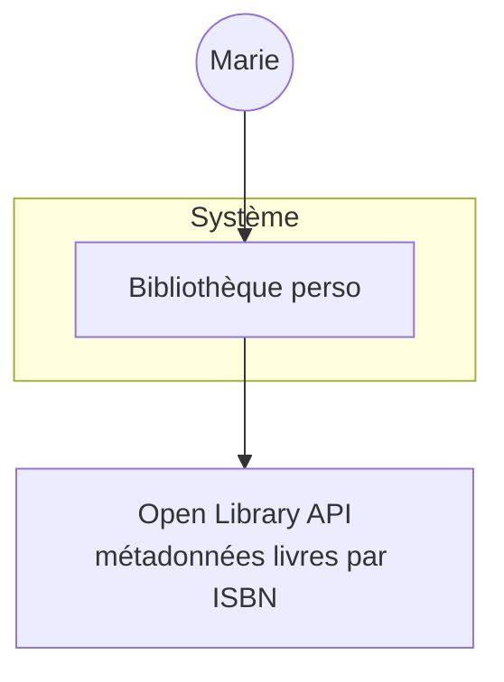
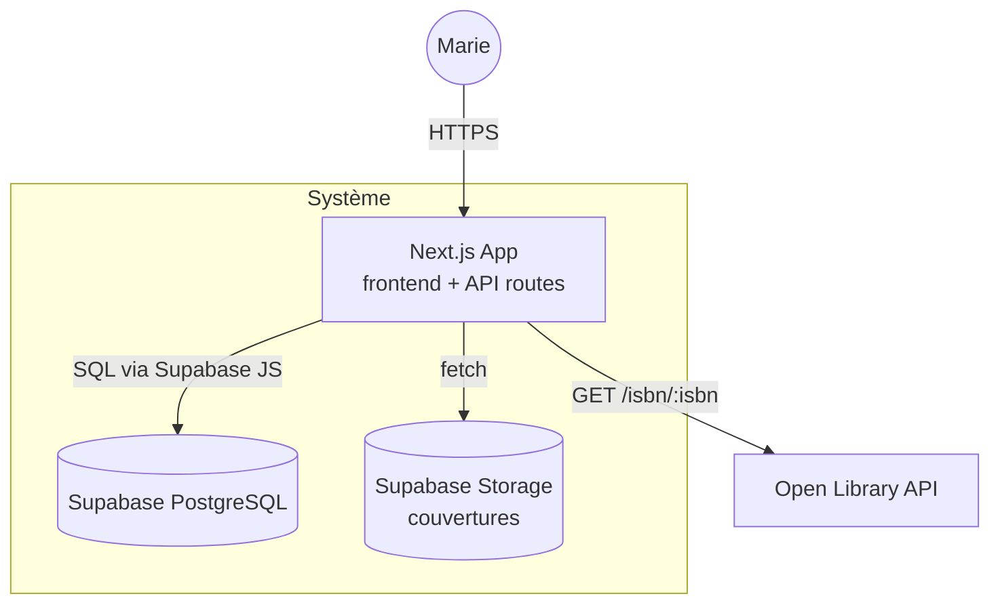

# Architecture C4

## Niveau 1 — Context

Acteurs et systèmes externes :

- **Marie** : utilisatrice unique (mono-utilisateur en V1).
- **Open Library** : API publique gratuite pour récupérer titre, auteur, couverture à partir d'un ISBN.

Pas d'autres systèmes externes en V1 (pas de mail, pas de paiement, pas d'analytics — projet privé).

## Niveau 2 — Container

## Stack technique proposée

| Couche | Technologie | Pourquoi |
|--------|-------------|----------|
| Frontend | Next.js 15 (App Router) + Tailwind CSS | Framework full-stack, mobile-first par défaut, déploiement instantané sur Vercel |
| Backend / API | Next.js Route Handlers | Pas besoin d'un serveur séparé pour ce volume ; Marie est seule utilisatrice |
| Base de données | Supabase (PostgreSQL managé) | Free tier généreux ; JSONB, full-text search, Row-Level Security ; pas de serveur à gérer |
| Auth | Supabase Auth (Magic link e-mail) | Gratuit, sécurisé, sans mot de passe à mémoriser pour Marie |
| Stockage images | Supabase Storage | Inclus, pas d'AWS à configurer |
| Hébergement | Vercel (free tier) | Déploiement Git-driven, HTTPS automatique, CDN inclus |

## Estimation

- **Volume V1** : 6 user stories, ≈ 8–12 jours-homme pour un dev intermédiaire
- **Coût mensuel d'infra** : 0 € (Vercel free + Supabase free) tant que < 500 Mo de DB et < 100 Go de bande passante. Largement couvert pour un usage perso.
- **Échelle** : tient sans problème jusqu'à 10 000 livres + 50 utilisateurs si Marie veut ouvrir à des amis plus tard.

## Pourquoi pas microservices, pas Kubernetes

Le projet a 1 utilisatrice, pas d'équipe, pas de pic de charge. Tout l'overhead opérationnel d'une archi distribuée serait pure perte. Un monolithe modulaire fait le travail en 10× moins de complexité.
