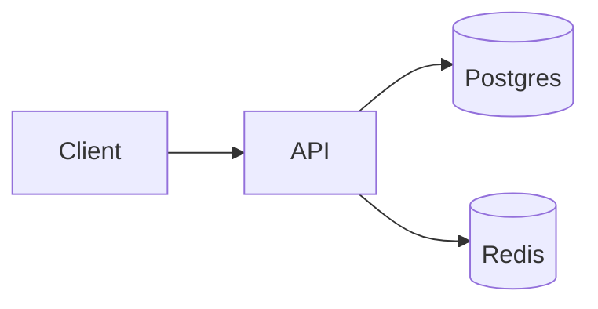

import ObjectiveList from '../../../components/ObjectiveList.astro';
import Quiz from '../../../components/Quiz.astro';
import { Aside } from '@astrojs/starlight/components';
import Level from '../../../components/Level.astro';

> 🎯 **Objectif** : écrire une doc **qu'on lit vraiment**. Une doc obsolète est pire que pas de doc : elle ment.

<ObjectiveList items={[
  "Rédiger un README qui amène un nouveau dev à `npm run dev` en 5 minutes",
  "Tracer les décisions d'archi avec un ADR",
  "Maintenir un CHANGELOG conforme à Keep a Changelog",
  "Générer une doc API OpenAPI à jour automatiquement",
  "Documenter les composants UI avec Storybook",
  "Distinguer les types de doc (Diátaxis : tutoriel, how-to, référence, explication)"
]} />

<Level value="confirmé" reading="10 min" prereq="axes 5-10 lus" />


## La règle d'or

> **Le code est la source de vérité. La documentation l'accompagne, ne le remplace pas.**

Conséquences :

- **Code lisible** > commentaires expliquant un code obscur.
- **Doc auto-générée** (OpenAPI, TypeDoc) > doc manuelle qui dérive.
- **Doc proche du code** (même repo) > wiki externe à part qui meurt.

## Le README — la première impression

C'est la première chose qu'un nouveau dev (ou ton toi-de-dans-6-mois) lit. Elle doit le mener à un projet **qui tourne** en quelques minutes.

### Template minimal qui marche

```markdown
# Nom du projet

> Description en une phrase

## Pourquoi
[2-3 phrases sur le problème résolu]

## Démarrage rapide
```bash
git clone ...
cd ...
npm install
cp .env.example .env
npm run dev
```

## Stack
- Next.js 16, TypeScript, Tailwind
- PostgreSQL via Prisma
- Vercel pour le déploiement

## Scripts
| Commande | Action |
|----------|--------|
| `npm run dev` | Lance le serveur de dev |
| `npm run build` | Build de prod |
| `npm test` | Lance les tests Vitest |

## Structure
```
src/
├── app/              ← Next.js App Router
├── components/       ← Composants partagés
└── lib/              ← Helpers, utils
```

## Contribuer
Voir [CONTRIBUTING.md](./CONTRIBUTING.md).

## Licence
MIT — voir [LICENSE](./LICENSE).
```

### Anti-patterns à éviter

- 📛 **Histoire du projet** (« Initié en 2019 par X… ») — personne ne lit.
- 📛 **Captures floues**, vidéos qui ne marchent plus.
- 📛 **Liens vers le wiki interne** (404 pour 80 % des lecteurs).
- 📛 **Étapes d'installation manuelles** que `npm install` fait déjà.

## Le CHANGELOG — qui change quoi quand

Le standard : [Keep a Changelog](https://keepachangelog.com/) + [Semantic Versioning](https://semver.org/).

```markdown
# Changelog

Tous les changements notables.

## [Unreleased]

## [1.4.0] — 2026-04-15

### Added
- Endpoint `/api/v1/exports` pour exporter les commandes en CSV.
- Mode sombre activé par défaut sur l'OS dark.

### Changed
- Le format des dates passe de `dd/mm/yyyy` à `yyyy-mm-dd`.

### Fixed
- Crash quand le mot de passe contient des accents.

### Security
- Mise à jour de `lodash` (CVE-2026-1234).

## [1.3.0] — 2026-03-22
…
```

### Génération automatique

Avec [changesets](https://github.com/changesets/changesets) :

```bash
npx changeset                    # ajoute un changeset à ton PR
npx changeset version             # bump version + génère CHANGELOG
npx changeset publish              # publish npm
```

Avec **Conventional Commits** + [semantic-release](https://github.com/semantic-release/semantic-release), le bump est même automatique.

## ADR — Architecture Decision Records

Déjà couvert en [3.4](/03-analyse-conception/04-architecture/#adr--architecture-decision-record). Rappel : un fichier Markdown par décision, dans `docs/adr/`, **versionné** dans Git.

```markdown
# ADR-007 : Migrer de Prisma vers Drizzle

## Statut
Accepté — 2026-04-29

## Contexte
Prisma engine consomme 200 Mo en cold start sur Cloudflare Workers,
ce qui dépasse la limite. Drizzle est compatible Workers natif.

## Décision
Migration progressive vers Drizzle. Co-existence pendant 1 sprint, puis suppression.

## Conséquences
✅ Bundle Workers passe de 12 Mo à 1.5 Mo
✅ Schema déclaratif comme Prisma
❌ Migration coût ~3 jours
❌ Drizzle ORM moins de magie (relations explicites)

## Alternatives
- Garder Prisma + Edge Runtime preview : retardé indéfiniment côté Vercel
- Kysely : bon mais pas de migrations DSL
```

## OpenAPI — la doc API qui ne ment pas

Quand tu écris une API REST, **génère** la spec OpenAPI plutôt que de la maintenir à la main.

### FastAPI (Python)

OpenAPI **automatique**. Tu écris :

```python
class UserOut(BaseModel):
    id: int
    email: EmailStr
    name: str

@app.get("/users/{user_id}", response_model=UserOut)
async def get_user(user_id: int) -> User: ...
```

→ `/docs` te donne **Swagger UI** + `/openapi.json` à jour. **Zéro maintenance.**

### Hono / Node.js

Avec [`hono/zod-openapi`](https://hono.dev/snippets/zod-openapi) :

```ts
import { OpenAPIHono, createRoute, z } from '@hono/zod-openapi';

const route = createRoute({
  method: 'get',
  path: '/users/{id}',
  request: { params: z.object({ id: z.coerce.number() }) },
  responses: {
    200: { content: { 'application/json': { schema: UserSchema } }, description: 'OK' },
  },
});

app.openapi(route, (c) => c.json({ id: 1, email: 'a@a.com', name: 'A' }));
```

### Symfony

API Platform génère OpenAPI à partir de tes entités. Voir axe 8 PHP/Symfony.

### Laravel

[Scribe](https://scribe.knuckles.wtf/) ou [Swagger PHP](https://github.com/zircote/swagger-php) — annotations.

## Storybook — documenter les composants UI

[Storybook](https://storybook.js.org/) génère un site qui montre **tous les états** de tes composants UI, en isolation.

```bash
npx storybook@latest init
```

```tsx
// Button.stories.tsx
import type { Meta, StoryObj } from '@storybook/react';
import { Button } from './Button';

const meta: Meta<typeof Button> = {
  component: Button,
  title: 'UI/Button',
};
export default meta;

type Story = StoryObj<typeof Button>;

export const Primary: Story = {
  args: { variant: 'primary', children: 'Click me' },
};

export const Disabled: Story = {
  args: { variant: 'primary', disabled: true, children: 'Disabled' },
};

export const Loading: Story = {
  args: { variant: 'primary', loading: true, children: 'Loading' },
};
```

✅ Designers et devs partagent le même langage visuel.
✅ Tu vois tous les états sans avoir à recréer le contexte applicatif.
✅ Tu testes l'a11y et la responsivité par composant.

❌ Maintenance non triviale sur de gros design systems.

**Verdict** : utile pour les **design systems d'entreprise** (équipes 10+ devs). Surdimensionné pour un side-project ou un MVP.

## Mermaid — les diagrammes versionnables

Tu l'as vu partout dans ce site. **Mermaid** est un format texte qui génère des diagrammes :



**Bénéfices** :
- **Versionné** dans Git (un diff Mermaid = un diff lisible).
- **GitHub/GitLab** rendent Mermaid nativement dans les README/MD.
- Pas besoin de Visio/draw.io ou de PNG qui dérivent.

Types de diagrammes utiles : `flowchart`, `sequenceDiagram`, `erDiagram`, `gantt`, `classDiagram`, `stateDiagram-v2`.

## Diátaxis — les 4 types de doc

Le framework [Diátaxis](https://diataxis.fr/) (créé par Daniele Procida) sépare la doc en **4 catégories distinctes** :

| Type | Question répondue | Style |
|------|-------------------|-------|
| **Tutoriel** | « Comment apprendre X depuis zéro ? » | Pas-à-pas guidé, axé apprentissage |
| **How-to** | « Comment faire Y ? » | Recette ciblée, axée objectif |
| **Référence** | « Quels sont les paramètres de Z ? » | Liste exhaustive, axée précision |
| **Explication** | « Pourquoi X marche ainsi ? » | Discussion, axée compréhension |

**Erreur classique** : un README qui mélange tout → le tutoriel est interrompu par des détails de référence, et personne ne s'y retrouve.

**Bonne pratique** :

```
docs/
├── tutorials/        ← « démarrer avec X »
├── how-to/           ← « envoyer un email transactionnel »
├── reference/         ← OpenAPI, types, configs
└── explanation/       ← « pourquoi RLS plutôt que middleware »
```

## Commentaires de code — quand ?

> *« Code tells you HOW; comments tell you WHY. »*

| Bon commentaire | Mauvais commentaire |
|------------------|----------------------|
| `// Stripe expects amounts in cents` | `// increment counter` (le nom le dit) |
| `// HACK: workaround for Safari bug #234` | `// for loop over users` (le code le dit) |
| `// Uses logarithmic complexity for large arrays` | (commentaire long expliquant un mauvais nom) |

### JSDoc / TSDoc / docblock PHP

Pour les **APIs publiques** d'une lib ou d'un service :

```ts
/**
 * Calcule le total TTC d'une commande.
 *
 * @param items - les lignes avec prix HT et quantité
 * @param taxRate - taux de TVA en décimal (0.20 pour 20 %)
 * @throws {InvalidOrderError} si items est vide
 * @returns le total TTC en centimes
 *
 * @example
 * ```ts
 * const total = computeTotal([{ priceCents: 1000, qty: 2 }], 0.20);
 * // 2400
 * ```
 */
export function computeTotal(items: Line[], taxRate: number): number { ... }
```

[TypeDoc](https://typedoc.org/) génère un site HTML à partir des TSDoc. Idem [phpDocumentor](https://www.phpdoc.org/), [pdoc](https://pdoc.dev/) (Python).

## Auto-évaluation

<Quiz
  question="Un nouveau dev rejoint l'équipe et clone le repo. Combien de temps avant `npm run dev` réussi ?"
  options={[
    'Demande à Bob, il sait',
    'README clair → < 5 min : git clone, cp .env.example, npm install, npm run dev. Si plus, ton README a des trous',
    "> 30 min, c'est normal",
    'Une demi-journée'
  ]}
  answerIndex={1}
  explanation="Le README est la première impression. Un nouveau dev (ou toi-même dans 6 mois) doit lancer le projet en < 5 minutes. Pour ça : .env.example complet, scripts npm tout-en-un, prérequis listés (Node 20+, Docker), une commande make setup idéalement. Si chaque setup demande de l'aide humaine, ça draine l'équipe."
/>

<Quiz
  question='Pour ton API REST en Hono ou FastAPI, doc OpenAPI ?'
  options={[
    'Tu maintiens un fichier openapi.yaml à la main',
    'Génération AUTOMATIQUE depuis tes schémas Zod ou Pydantic — la doc ne dérive jamais. Swagger UI gratuit à /docs',
    'Pas de doc, le code suffit',
    'Une page Notion partagée'
  ]}
  answerIndex={1}
  explanation='OpenAPI auto-généré est la magie 2026. FastAPI le fait nativement. Hono via @hono/zod-openapi. Symfony via API Platform. Le bénéfice : quand tu changes le schéma Zod/Pydantic, la doc OpenAPI suit AUTOMATIQUEMENT. Une doc maintenue à la main dérive en 2 sprints.'
/>

<Quiz
  question='Tu vois `// increment counter` dans le code. Avis ?'
  options={[
    'Très utile, on comprend mieux',
    'Inutile (le code le dit déjà). Un bon commentaire explique le POURQUOI (HACK, edge case, contrainte externe), pas le QUOI',
    'Manque de contexte',
    'Erreur de syntaxe'
  ]}
  answerIndex={1}
  explanation="Le code expliquant lui-même est l'idéal. Un commentaire qui dit la même chose en français est du bruit qui dévie au refacto. Garde des commentaires pour : pourquoi (workaround, contrainte légale), pas évident (algo complexe), ou attention (TODO, FIXME, HACK). Sinon, renomme la variable."
/>

## Pour aller plus loin

- *Keep a Changelog* — [keepachangelog.com](https://keepachangelog.com/)
- *Diátaxis* — [diataxis.fr](https://diataxis.fr/)
- *Documenting Architecture Decisions* — Michael Nygard
- *The Documentation System* — Daniele Procida (talk vidéo)
- *Storybook Docs* — [storybook.js.org](https://storybook.js.org/)
- *TypeDoc* — [typedoc.org](https://typedoc.org/)

---

**Fin de l'axe 11.** Direction l'[axe 12 — Sécurité applicative](/12-securite/), ou attaque le projet **Refactor + tests**.
